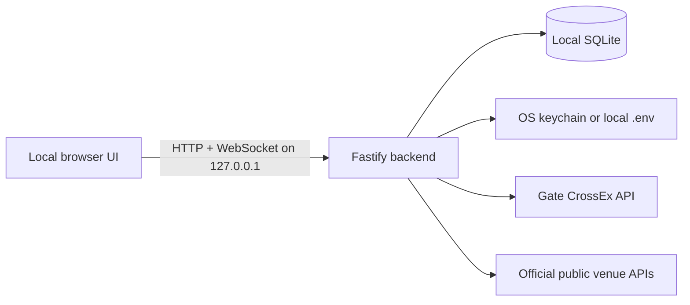

# Architecture

Gate CrossEx is a single-user application that runs entirely on the user's computer. It has no hosted backend, telemetry, analytics, account system, or maintainer-controlled data service.

## Components

```text
apps/backend          Fastify API, exchange adapters, strategies, SQLite
apps/frontend         React/Vite user interface
packages/domain       Decimal-safe trading helpers
packages/public-data  Unauthenticated venue-data adapters
packages/shared-types Runtime schemas and shared contracts
migrations            Immutable checksummed SQLite migrations
scripts               Launch, maintenance, test, and release tooling
```



The frontend never connects directly to an exchange and never receives stored credentials. The backend validates local Host/Origin, CSRF tokens, intent headers, and runtime schemas before handling sensitive actions.

## Data and credentials

- SQLite uses foreign keys, WAL journaling, integrity checks, and an owner-only process lock.
- Applied migration filenames and SHA-256 checksums are immutable.
- Financial values remain decimal strings at API boundaries and use decimal-safe arithmetic.
- Credentials live in isolated account profiles in the OS keychain by default or in an explicitly selected, gitignored, owner-only `.env` file. SQLite stores only non-secret profile metadata and the active-profile pointer. Switching profiles locks trading, verifies the target key, clears authenticated account caches, and reconnects the private stream.
- Logs and audit records are bounded and redact credential material and sensitive headers.

## Market and account state

The backend validates CrossEx REST snapshots and public/private WebSocket pushes before normalizing them for the UI. Detailed market subscriptions are demand-driven and bounded. Official unauthenticated venue APIs supply reference data that CrossEx does not expose directly.

Private account pushes update one account-wide in-memory projection. Periodic REST reconciliation remains the recovery and ledger path; newer stream events are replayed over in-flight snapshots so older responses cannot overwrite them silently.

See [integration boundaries](integration.md) for the external endpoint and channel allowlist.

## Trading boundary

- The application is live-only; it has no paper-trading execution path.
- Every process starts locked. Orders, leverage changes, transfers, and strategies require explicit authorization for that session.
- Authenticated exchange access is a fixed allowlist, not a generic request proxy.
- Ambiguous remote results remain unresolved until reconciliation proves terminal state.
- Strategies act only on fresh validated quotes, track acknowledged fills, repair leg imbalance, and pause when recovery fails.
- Locking trading, changing credentials, stopping a strategy, or shutting down quiesces locally tracked open orders. If Gate will not act on the id the terminal holds, its open-order list is the fallback authority: an id absent from that list is closed locally, an order listed under another id is adopted and cancelled by that id, and anything still unconfirmed blocks live activation and is reported with a per-order reason.

## Distribution

Source launchers build and run the same local backend and frontend. Prebuilt macOS and Windows archives add a private Node.js runtime and platform-specific per-user startup integration. Installers verify the archive checksum and manifest, back up the database before updates, health-check new versions, and roll back failed activation.
